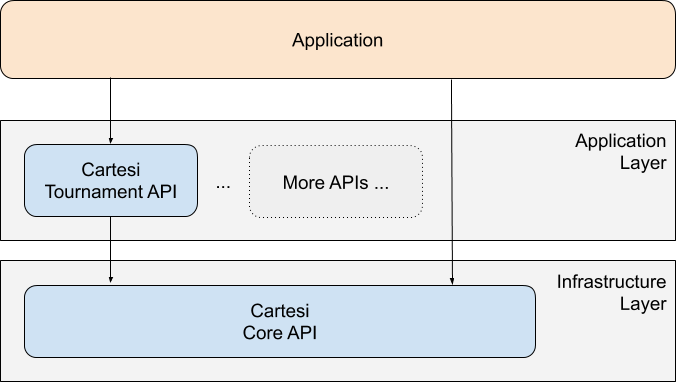

Before diving down into using Cartesi, it pays off to have a top-level view of how the SDK is organized.

The Cartesi SDK is currently divided into an _infrastructure layer_ and an _application layer_. Each layer contains its own APIs, and application layer APIs are implemented using what the infrastructure layer exposes through its API. 

The infrastructure layer is currently synonymous with the **Cartesi Core API**. Currently, all Cartesi features implemented at the infrastructure layer are implicitly part of the Core API.

The application layer is where higher-level, domain-specific APIs are provided. The first application-layer API that is made available is the **Cartesi Tournament API**, which allows the development of tournament DApps that have are based on a tournament dispute like the one showcased by the [Creepts](https://creepts.cartesi.io) DApp.

DApps, and libraries and frameworks that provide support for DApps, can be developed directly on top of the Core API. However, that will be more complex than using an appropriate application-level API. The Cartesi Project's ultimate goal is to provide powerful and easy-to-use application-layer APIs that cover the needs of most DApps, so that developers always have to invest the least amount of effort to benefit from Cartesi's Layer 2 solutions.

On the other hand, the Core API gives access to the basic building blocks of the Cartesi stack, whenever it is deemed necessary for a client. For example, using the Core API is desirable for projects who want to build their own application-layer APIs for their own use cases, or optimize, customize or adjust existing application-layer libraries and engines to their needs.

> **NOTE:** The following tutorials will demonstrate the use of both the Tournament API and the Core API, and will be expanded as new application-layer APIs and new core functionality is released. 
