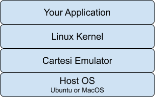
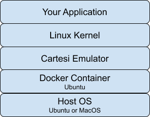

## About this tutorial

Cartesi Machines are a central component of every DApp built on top of the Cartesi system. Each one of your DApps will need at least one custom Cartesi Machine that you will create for them.

In this tutorial, we will learn all of the essential concepts related to Cartesi Machines, and then we are going to create a trivial Cartesi Machine that runs a "Hello, World!" shell script. That machine will not be plugged into a complete DApp (we will leave that for later tutorials).

## What are Cartesi Machines?

There is an in-depth specification and explanation of Cartesi Machines in the [Cartesi Whitepaper](https://cartesi.io/cartesi_whitepaper.pdf). Although you will acquire a more deep understanding of what they are if you read the whitepaper, this tutorial does not assume that you know anything at all about them. Instead, we will at first offer a simplified view of what they are, upon which we will gradually expand as the tutorials progress.

For the purposes of this tutorial, you can understand a Cartesi Machine as a software package that contains:

1. The Cartesi RISC-V machine emulator software (which runs on top of _your_ OS and hardware),
1. A minimalist Linux installation that is compiled for the Cartesi RISC-V machine emulator, and
1. Your DApp -- that is, a Linux-based software component that your DApp needs to run off-chain in a reproducible manner.

The [machine emulator](https://github.com/cartesi/machine-emulator) and the Linux installation's components ([ROM](https://github.com/cartesi/machine-emulator-rom), [Kernel](https://github.com/cartesi/image-kernel) and [Filesystem](https://github.com/cartesi/image-rootfs/)) can be built using Ubuntu 18.04 or MacOS.

However, for convenience, the Cartesi Project publishes a Docker image called `cartesi/machine-emulator`. It is an Ubuntu 18.04-based image that contains the pre-built emulator, so you don't have to build it yourself.

Cartesi also releases binaries for the ROM, Kernel and Filesystem components, which can be obtained from the "Releases" section of their respective GitHub repositories (you do not need to download these files now):

- ROM: <https://github.com/cartesi/machine-emulator-rom/releases> (usually named `rom.bin`)
- Kernel: <https://github.com/cartesi/image-kernel/releases> (usually named `kernel.bin`)
- Filesystem: <https://github.com/cartesi/image-rootfs/releases> (usually named `rootfs.ext2`)

Thus, all the software we need to develop for our first "Hello, World!" Cartesi Machine is our DApp code, which will be a simple shell script that prints the "Hello, World!" message from within the RISC-V-emulated Linux shell process. We will also need to write some script files to help us build and run our "Hello, World!" Cartesi Machine.

## What do we do with Cartesi Machines?

The idea is that any participant in a multi-party, decentralized, off-chain Cartesi computation that wants to verify the exact result of performing that computation, will:

1. Start up the Cartesi RISC-V machine emulator, supplying the required ROM, Kernel and Filesystem binaries. As a result, the emulated RISC-V machine will boot up and run a bare-bones Linux installation, thus creating a Linux-based, fully-emulated, deterministic virtual machine;
1. Run a custom, deterministic computation (a component of your DApp) inside of the virtual machine.

> **NOTE: ** These steps are managed automatically by the higher-level components of the Cartesi SDK. Outside of these tutorials, you do not actually need to write any code for your DApp to manage Cartesi Machines at runtime. However, knowing how to interact manually with Cartesi Machines (such as starting and stopping them) will help you in testing and in debugging any issues with machine creation that you may run into.

The running stack of a Cartesi Machine will look like this (if you have the emulator built for and installed in your host machine):

If your DApp project is using the Cartesi Machine Emulator that is distributed as the `cartesi/machine-emulator` image, then it will look like this:

In the next section, we begin building the "Hello, World!" machine.

